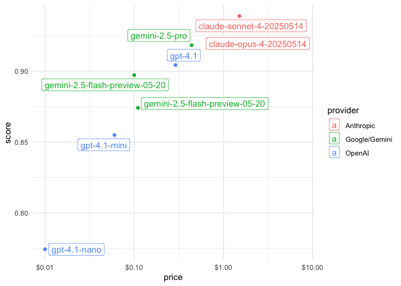

<!-- README.md is generated from README.Rmd. Please edit that file -->

# The chores eval

<!-- badges: start -->

[](https://lifecycle.r-lib.org/articles/stages.html#experimental)
[](https://CRAN.R-project.org/package=choreseval)

<!-- badges: end -->

The [chores](https://posit.co/blog/introducing-chores/) package connects
an extensible library of LLM assistants to your IDE aimed at helping you
with tedious but hard-to-automate tasks. For the most capable LLMs
today, like Anthropic’s Claude 4 Sonnet or OpenAI’s GPT 4.1, carrying
out the sorts of tasks that chores supports is easy peasy. However,
those models cost money (and require entrusting your IP with a
for-profit company), and it’s a bit of a hoot to ask R users to put
their credit card information down to use an R package.

This has made me wonder: **Is it possible to use chores with a locally
running LLM?** The chores eval evaluates how well a large language model
will perform as the model powering chores with the goal of helping me
identify a model that chores users can run themselves on a modest
laptop.

The chores eval is implemented with
[vitals](https://vitals.tidyverse.org/), an LLM eval framework for R.

## Installation

choreseval is implemented as an R package for ease of installation:

``` r
pak::pak("simonpcouch/choreseval")
```

Load it with:

``` r
library(choreseval)
```

## Example

As a reader of the eval, you’re mostly likely interested in `chores`, a
dataset of compiled evaluation results:

``` r
library(tibble)

chores
#> # A tibble: 8 × 6
#>   name                          provider      model         score price metadata
#>   <chr>                         <chr>         <chr>         <dbl> <chr> <list>  
#> 1 claude_opus_4                 Anthropic     claude-opus-… 0.917 $7.52 <tibble>
#> 2 claude_sonnet_4               Anthropic     claude-sonne… 0.939 $1.51 <tibble>
#> 3 gemini_2_5_flash_non_thinking Google/Gemini gemini-2.5-f… 0.874 $0.11 <tibble>
#> 4 gemini_2_5_flash_thinking     Google/Gemini gemini-2.5-f… 0.897 $0.10 <tibble>
#> 5 gemini_2_5_pro                Google/Gemini gemini-2.5-p… 0.918 $0.44 <tibble>
#> 6 gpt_4_1_mini                  OpenAI        gpt-4.1-mini  0.855 $0.06 <tibble>
#> 7 gpt_4_1_nano                  OpenAI        gpt-4.1-nano  0.774 $0.01 <tibble>
#> 8 gpt_4_1                       OpenAI        gpt-4.1       0.904 $0.29 <tibble>
```

``` r
library(tidyverse)
library(ggrepel)

chores |>
  mutate(price = as.numeric(gsub("$", "", price, fixed = TRUE))) |>
  ggplot(aes(x = price, y = score, color = provider, label = model)) +
  geom_point() +
  geom_label_repel() +
  scale_x_log10(labels = scales::dollar_format()) +
  theme_minimal() +
  labs(x = "Price (USD, per 100 refactorings)", y = "Score")
```



The `chores_task()` function defines a task with the package’s built-in
dataset, solver, and scorer:

``` r
tsk <- chores_task()

tsk
#> An evaluation task The-chores-eval.
```

Run `$eval()` with the `solver_chat` of your choice to measure how well
that model does on the eval:

``` r
tsk$eval(
  solver_chat = ellmer::chat_anthropic(model = "claude-3-7-sonnet-latest")
)
```
